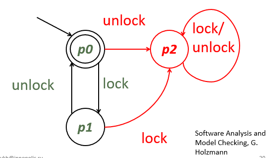
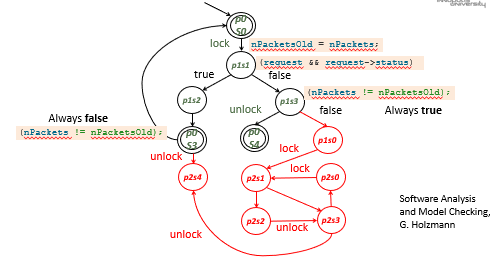

# Software verification

Purpose
To establish the  quality levels achieved 
To justify confidence in the software by
Demonstrating that it does what it is supposed to do under its stated conditions
It doesn’t do what is not supposed to do under adverse conditions
Verification is a continuous process, is not something that happens at the end


# Software verification techniques

Inspection
Analysis 
Testing
Demonstration

# 1. Inspection

## What is Inspection?
International Council on System Engineering (INCOSE)
The verification method of determining performance by examining (a) engineering documentation produced during development or modification or (b) the item itself using visual means or simple measurements not requiring precision measurement equipment
Software practitioner
The scrutiny by people other than the producer, of human oriented development artifacts with the aim of meeting contractual obligations, finding non-compliances with standards or uncovering defects based on the premise that individuals might be blind to some of the trouble spots in their own work and in consequence it is beneficial to have someone else look at it
Uses
Complements  testing. Comes earlier in the process. Germane to the verification of faults of omission, design problems, style issues
Examples
The review of code to find if it properly commented and styled
Faults of omission and misunderstandings
Duplications
Problems in documentation

## Benefits of inspection

Reduce the number of defects in software earlier in the development process
Hewlett-Packard, ROI 10 to 1. Savings estimated at $21.4 million per year. [1]
AT&T Bell, ten-fold improvement in quality and a 14 percent increase in productivity at Bell Laboratories [2]
Bell Northern Research, average savings of 33 hours of maintenance effort per defect discovered [3]
CISCO, Some of our results exactly match those from established literature[4]
Uncover defects that would be difficult or impossible to discover by means of testing
Improve learning and communication within the software team

[1] Grady, Robert B., and Tom Van Slack. “Key Lessons in Achieving Widespread Inspection Use,” IEEE Software, Vol. 11, No. 4 (July 1994), pp. 46-57.
[2] Humphrey, Watts S. Managing the Software Process. Reading, Massachusetts: Addison-Wesley, 1989
[3] Russell, Glen W. “Experience with Inspection in Ultra large-Scale Developments,” IEEE Software, Vol. 8, No. 1 (January 1991), pp. 25-31.
[4] J. Cohen, Code Review at Cisco Systems, 2006


## Family of inspection techniques
Adapted from K. Wiegers, Peer Reviews in Software: A Practical Guide, 2002    

From most formal to least formal:

Fagan inspections:
    A technique with well defined entry and exit conditions, where somebody other than the author of the artifact presents it to the participants. There are many types of inspections: Fagan’s, N-fold, Phased, Gilb’s

Team review:
    Review: A process or meeting during which a software product is presented to project personnel, managers, users, customers, user representatives, or other interested parties for comment or approval

Walkthtough:
    Walkthrough: A technique in which a designer or programmer leads members of the development team and other interested parties through a software product, and the participants ask questions and make comments about possible errors, violation of development standards, and other problems
    
Tool-assisted code review
    An integral part of coding process One developer writes code, another developer is asked to review that code providing a line-by-line critique. Assisted by tools, e.g. diff, annotations, email, review history, online commenting
    
Pair programming

Adhoc review

# 2. Analysis

## What is (Static) Analysis?
INCOSE
The performance and assessment of calculations (including modeling and simulation) to evaluate requirements or design approaches or compare alternatives. 
The verification method of determining performance (a) by examination of the baseline, (b) by performing calculations based on the baseline and assessing the results, (c) by extrapolating or interpolating empirical data of collected using physical items prepared according to the baseline, or (d) by a combination of all of the above. 
Software practitioner
The verification of software properties through the use of syntactic, behavioral or structural information from the software, e.g. the state space of a program, its patterns of execution, an abstract model, etc.; in contrast to the computed values used in testing
There are two types of software analysis: Dynamic and static

### Uses
Style issues, dangerous constructs
Verification of safety properties
Verification of liveness properties
Verification of fairness properties
Verification of temporal properties
Examples
Security vulnerabilities, memory leaks
Code non-compliances
Resource usage

### Some properties
Safety Properties
A safety property asserts that nothing bad will happen during the execution of the program (e.g., no deadlocks, or no attempts to take an item from an empty buffer). Safety properties are used mainly to ensure consistency of the program state, for example by making sure that:
Shared resources are updated atomically (mutual exclusion), or
The state of shared resources is kept consistent by delaying certain operations (condition synchronization)

Liveness Properties
A liveness property asserts that something good eventually happens, and is used mainly to ensure progress. Liveness properties prevent:
Starvation: Processes not getting the resources they need (e.g., CPU time, locks)
Dormancy: Waiting processes fail to be awakened
Premature termination: Processes killed before they are supposed to be

Fairness Properties
A fairness property is essentially a liveness property which holds that something good happens infinitely often (for example, a process activated infinitely often during an application execution —each process getting a fair turn).

Temporal Properties
    Properties that hold for a state in isolation are called state properties. Temporal (or path) properties relate state properties of distinct states in the state space to each other. Such properties are also referred to as dynamic properties. Temporal properties can be expressed as statements about the relation of different state properties along possible execution paths. For example, a temporal property can state that all paths which contain a send signal emitted at one state will also contain a later state where the signal has been received.
    α: α holds in the current state
    Xα: α holds in the next state
    Fγ: γ holds eventually
    Gλ: λ holds from now on
    (α U β): α holds until β holds

### Analysis fault taxonomy (incomplete list)
Concurrency
Race conditions
Deadlock
Data protected by locks
Non-lock concurrency

Exceptional conditions
Integer over/underflow
Division by zero
Unexpected exceptions
Not handling error cases
Type conversion errors

Input validation
Command injection
Cross-site scripting
Format string
Tainted data

Code quality
Metrics
Unused variables

Memory errors
Array bounds / buffer overrun
Illegal dereference (null, integer, freed)
Illegal free (double free, not allocated)
Memory leak
Use uninitialized data

Resource/protocol errors
Calling functions in incorrect order
Failure to call initialization function
Failure to free resources

Design and understanding
Dependency analysis
Heap structure
Call graph

Other security
Privilege escalation
Denial of service
Dynamic code
Malicious trigger
Insecure randomness
Least privilege violations

## Analysis discussion

Analysis involves the manual or automatic creation of a model of the system or software of interest and the verification of its properties on the model instead of through the execution of the software
By omitting all the details that are not relevant to a specific verification it becomes possible* to prove (or disprove) that a software exhibits or not a certain property

*Possible means that the analysis might exhibit false negatives (unsound) and false positives (incomplete)

Soundness. If the analysis says the program is OK, there are no bugs. No false negatives (there is a fault and the analysis fails to reveal it)
Completeness: If the analysis gives a warning, it is real. No false positives (there is no fault but the analysis says there is)
• Contrast: Testing is complete, but not sound
• No static analysis can be sound, complete, and terminating
• Perfect static analysis is undecidable on nontrivial programs for even simple attributes
• Thus, every analysis approximates (using abstraction)
• Many static analyses are useful nevertheless
• E.g. a sound tool with few false positives in practice


## Methods and approaches

Static analysis
Works directly off programs; can establish weak (but important) properties such as absence of arithmetic overflow, no reference to initialized variables etc. Example: Lint, FindBugs, SONAR, CodeQL, CodeSense

Model checking
Works off a special modeling language; basically brute force enumeration and searching. Mostly automatic, once the model is built. Example: Spin

Theorem proving
Works off a special modeling language; usually requires skilled human guidance. 
Example: PVS, ESC/Java (partially)

### Example. Model checking

From 
Software Analysis and Model Checking, G. Holzmann

We want to check if this piece of code respects the normal locking discipline that says that it would be an error if a single thread could:
Attempt to lock a resource for which already holds a lock
Attempt to unlock a resource when it does not currently hold the lock
Terminate execution with the lock still in effect


```c
do{ 
  lock (&devExt->writeListLock); // S0
  nPacketsOld = nPackets;
  request = devExt->WriteListHeadVa;
  if (request && request->status){  // S1
    devExt->WriteListHeadVa = request->nxt;
    unlock(&devExt->writeListLock); // S2
    nPackets++;
  }
} while (nPackets != nPacketsOld);  // S3
unlock(&devExt->writeListLock); // S4
```

flowchart TD
    S0["S0: lock(&devExt->writeListLock)"]
    S1["S1: if (request && request->status)"]
    S2["S2: unlock(&devExt->writeListLock)"]
    S3["S3: while (nPackets != nPacketsOld)"]
    S4["S4: unlock(&devExt->writeListLock)"]

    S0 --> S1
    S1 -- "true" --> S2
    S1 -- "false" --> S3
    S2 --> S3
    S3 -- "true" --> S0
    S3 -- "false" --> S4



Property to be verified
Normal locking discipline. There is an error if a single thread would:
Attempt to lock a resource for which already holds a lock
Attempt to unlock a resource when it does not currently hold the lock
Terminate execution with the lock still in effect

Finite State Machine
p2  - error state



stateDiagram-v2
    state P2 <<error>>
    style P2 fill:#ffcccc,stroke:#ff0000,stroke-width:2px

    [*] --> P0
    P0 --> P1 : lock
    P1 --> P0 : unlock

    P1 --> P2 : lock
    P0 --> P2 : unlock

    P2 --> P2 : lock
    P2 --> P2 : unlock

    state "P0" as P0
    note right of P0
        Unlocked
    end note

    state "P1" as P1
    note right of P1
        Locked
    end note

    state "P2" as P2
    note right of P2
        Error state
    end note







stateDiagram-v2

    style P2 fill:#ffcccc,stroke:#ff0000,stroke-width:2px
    style P2S4 fill:#ffcccc,stroke:#ff0000,stroke-width:2px
    style P1S0 fill:#ffcccc,stroke:#ff0000,stroke-width:2px
    style P2S1 fill:#ffcccc,stroke:#ff0000,stroke-width:2px
    style P2S2 fill:#ffcccc,stroke:#ff0000,stroke-width:2px
    style P2S3 fill:#ffcccc,stroke:#ff0000,stroke-width:2px
    style P1S0 fill:#ffcccc,stroke:#ff0000,stroke-width:2px
    style P1S0 fill:#ffcccc,stroke:#ff0000,stroke-width:2px

    [*] --> P0S0
    P0S0 --> P1S1 : nPackets == nPacketsOld => loc
    P1S1 --> P1S2 : (request && request->status) => true

    P1S2 --> P0S3
    P0S3 --> P0S0: nPackets != nPacketsOld => Always false

    P0S3 --> P2S4: unlock => error

    P1S1 --> P1S3 : !(request && request->status) => false
    P1S3 --> P0S4 : unlock
    # P0S4 --> [*]
    P1S3 --> P1S0 : nPackets != nPacketsOld => Always true
    
    # error area
    P1S0 --> P2S1 : lock
    P2S1 --> P2S2
    P1S0 --> P2S1 : lock
    P2S2 --> P2S3 : unlock
    P2S3 --> P1S0
    P2S1 --> P2S3
    P2S3 --> P2S4 : unlock





We want to check if this piece of code respects the normal locking discipline that says that it would be an error if a single thread could:
Attempt to lock a resource for which already holds a lock
Attempt to unlock a resource when it does not currently hold the lock
Terminate execution with the lock still in effect

The initial state, p0, is also marked as an accepting state, by which we express that all finite runs that start in p0 should terminate in p0. State p2 is really an error state. Any transition into that state may immediately be flagged as an error.

There are two end states in the product automaton: p2 s4 and p0 s4, but only p0 s4 is accepting. There are also two strongly connected components: C1 = { p0 s0, p1 s1, p1 s2, p0 s3 }, and C2 = { p2 s1, p2 s2, p2 s3, p2 s0 }, only one of which contains accepting states (C1). Any feasible finite path that starts in p0 s 0 and that ends in p2 s 4 would correspond to a violation of the locking property. Similarly, any feasible infinite path that reaches p2 s 1 corresponds to a violation.

## Soundness and completeness

A “sound” static analysis over approximates the behaviors of the program. A sound static analyzer is guaranteed to identify all violations of a property , but may also report some “false alarms", or violations that cannot actually occur

A “complete” static analysis under approximates the behaviors of the program. Any violation of the property  reported by a complete static analyzer corresponds to an actual violation of, but there is no guarantee that all actual violations of  will be reported


>No static analysis can be sound, complete, and terminating

Rice’s Theorem says there are inherent limits on what can be
accomplished by automated analysis of programs

◦ Sound (miss no errors)
◦ Complete (no false alarms)
◦ Automatic
◦ Allow arbitrary (unbounded) memory structures
◦ Final results

For assurance, we need soundness. When told there are no errors, there must be none → we have to accept false alarms. But the main market for static analysis is bug finding in general-purpose software, where they aim merely to reduce the number of bugs, not to eliminate them. Customers in general will not tolerate many false alarms, so tool vendors give up soundness. Others give up full automation: e.g., require user annotation

Commercial tools (e.g., Coverity, Code Sonar, Fortify, KlocWork, LDRA) are neither sound nor complete. 
• Pragmatically effective
• Different tools use different methods, have different capabilities, make different tradeoffs

Lint & Findbugs are pattern matchers (e.g.) are not based on semantics of program execution, neither sound nor complete
• But pragmatically effective for bug finding

### Techniques and tools

Technics
Static analysis
Abstract interpretation
Model checking 
Bug patterns
Data flow analysis
Formal proofs
Petri nets

Tools
Spin
Java Path Finder
FindBugs
JLint
ESC/Java
CodeSonar
PolySpace
Fortify 360
Klocwork
Microsoft’s PREfast & SDV
PIPE

### Limitations

Non-functional verification
False positives
False negatives
Performance/scalability

The price to pay for exhaustive coverage is incompleteness: the analyzer can raise false alarms on some operations that are actually safe. However, if the analyzer deems an operation safe, then this property holds for all possible execution paths.


