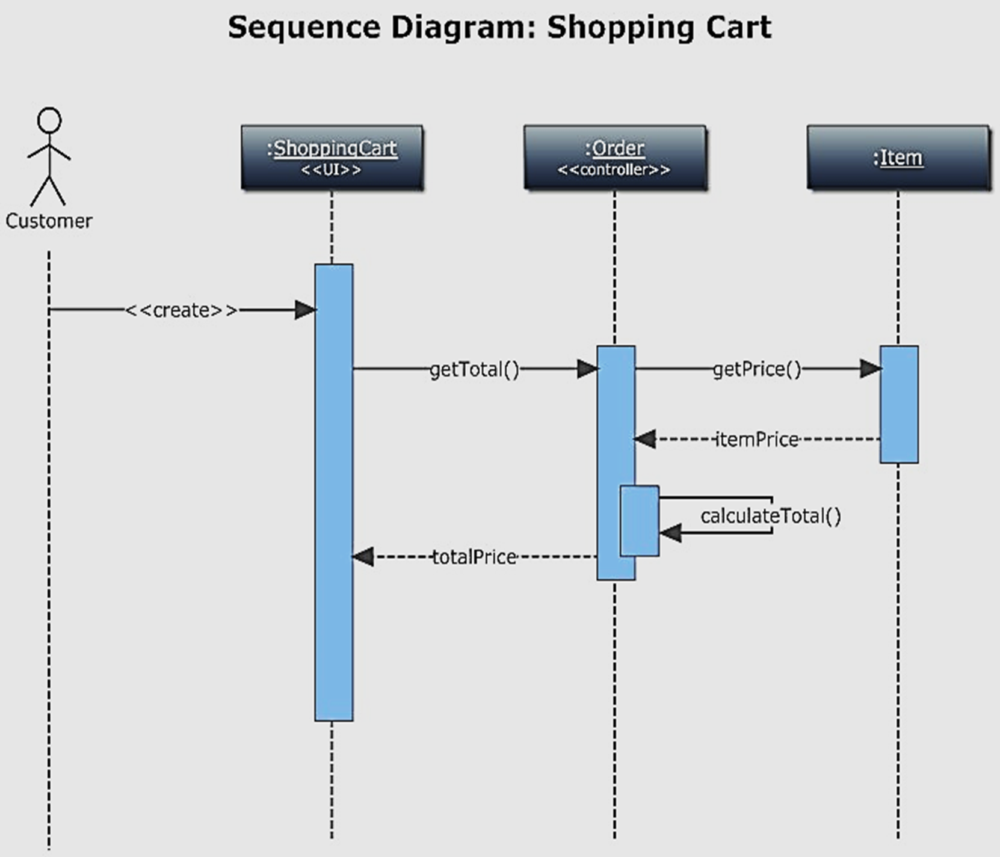
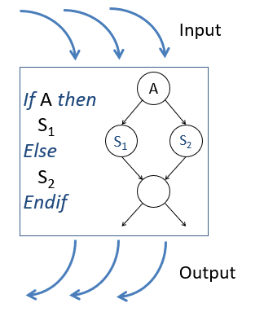
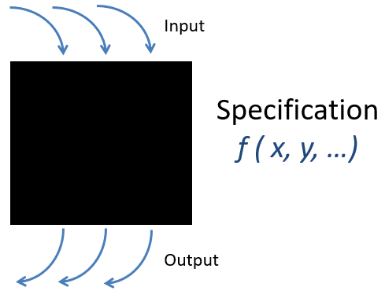

# Testing

## What is testing?

INCOSE

    The verification method of determining performance by exercising or operating the system or item using instrumentation or special test equipment that is not an integral part of the item being verified. Any analysis of the data recorded in the test and that is needed to verify compliance (such as the application of instrument calibration data) does not require interpretation or interpolation/extrapolation of the test data. 

Software practitioner

    The (more or less) thorough execution of the software with the purpose of finding bugs before the software is released for use and to establish that the software performs as expected
Uses

    Verification of functional and performance requirements

Examples

    When provided with the correct user name and password the user is able to login into the system
    The software is capable of handling a load of thousand transactions per minute

> When we test something, our purpose is to make it fail. As a matter of fact  a good test case is one that uncovers a fault. Goal is to falsify the property, it is much easier then to prove correctness. 

## How tests can be classified? Taxonomy

by Level

    Unit
    Integration
    Thread, function, integration, unit, medium
    System

by Purpose or characteristic being tested

    Functional correctness
    Robustness
    Performance
    Regression
    Acceptance

by Source of test cases

    Specification (Black box testing)
    Structure (White box testing)
    Model based
    Experience (Exploratory testing)

by Targeted faults

    Computational
    Domain
    Variable interactions
    Value propagations
    Variable usages

by Test execution mode

    Manual
    Automated

### Unit testing

A “unit” (object, procedure, subprogram) usually created by a single developer
Typical faults: missing/wrong functionality, domain faults, data corruption, error conditions
Defects found are typically kept private and fixed by the same person that developed the code
Can take place before and/or after code review
Runs in a simulated environment (drivers and stubs)
Adequacy measured through statement, branch, basis path, MC/DC coverage or mutation testing


sequenceDiagram
    actor Customer
    participant SC as ShoppingCart
    box "Unit Under Test"
        participant O as Order
    end
    participant I as Item

    Customer->>SC: Add items and get total
    SC->>O: Create order
    O->>I: Get item prices
    I-->>O: Return item prices
    O-->>SC: Return total price
    SC-->>Customer: Display total price


#### Mocking

sequenceDiagram
    actor Developer
    participant TestFramework
    participant CodeUnderTest
    participant MockService

    Developer->>TestFramework: Write test cases
    TestFramework->>CodeUnderTest: Call functions with inputs
    CodeUnderTest->>MockService: Send mock API call
    MockService-->>CodeUnderTest: Return mock response
    CodeUnderTest-->>TestFramework: Return output
    TestFramework->>Developer: Compare output with expected results
    alt Output matches expected
        TestFramework->>Developer: Test passed
    else Output does not match expected
        TestFramework->>Developer: Test failed
    end


### Integration testing

Involves two or more interacting units
Typical faults: Interface misuse and misunderstanding
The focus is on the adjacent interactions
Is performed by the developer of the unit being integrated or by a specialized function  
Defects are usually reported
Runs in a development environment
Adequacy measured through node or edge coverage of immediate neighbors

> Interface Misuse - A calling unit calls another unit and makes an error in its use of interface, probably by calling/passing parameters in the wrong sequence.
Interface Misunderstanding - A calling unit makes some assumption about the other unit’s behavior which is incorrect.


sequenceDiagram
    actor Customer
    participant SC as ShoppingCart
    box "Integration Test"
        participant O as Order
        participant I as Item
    end
    participant I as Item

    Customer->>SC: Add items and get total
    SC->>O: Create order
    O->>I: Get item prices
    I-->>O: Return item prices
    O-->>SC: Return total price
    SC-->>Customer: Display total price


### Thread, function, integration testing

Involves two or more interacting units
Focus in end to end functionality
Is performed by the developer of the unit being integrated or by a specialized function  
Defects are usually reported
Runs in a development environment


sequenceDiagram
    actor Customer
    box "Function Test"
        participant SC as ShoppingCart
        participant O as Order
        participant I as Item
    end
    participant I as Item

    Customer->>SC: Add items and get total
    SC->>O: Create order
    O->>I: Get item prices
    I-->>O: Return item prices
    O-->>SC: Return total price
    SC-->>Customer: Display total price


### System testing

Encompass end-to-end functionality and other system-level characteristics. 
Typical faults: Undesirable interactions, negative test cases
Is not performed by the developer
Defects are reported
Runs in a real environment
Adequacy measured by combinatorial coverage or  mutation testing


sequenceDiagram
    box "System Test"
        actor Customer
        participant SC as ShoppingCart
        participant O as Order
        participant I as Item
    end
    participant I as Item

    Customer->>SC: Add items and get total
    SC->>O: Create order
    O->>I: Get item prices
    I-->>O: Return item prices
    O-->>SC: Return total price
    SC-->>Customer: Display total price


### Purpose-based testing

What things do we want to test? A non-exhaustive list of the software characteristic being tested

Functions. See that each function does what it’s supposed to do and not what it isn’t supposed to do
Look for any data processed by the product. Look at outputs as well as inputs
Decide which particular data to test with. Consider things like boundary values, typical values, convenient values, and invalid values
Consider combinations of data worth testing together

Regression - Re-testing of something that was already working, usually with existing test cases, to provide confidence that the system under test (SUT) still functions correctly following modification or extension of the system (such as user enhancements or upgrades or following new builds or releases of the software)

Scenarios. Test to a compelling story. Do one thing after another
Define test procedures or high level cases that incorporate multiple activities connected end-to-end 
Don’t reset the system between tests. 
Vary timing and ordering of events

Efficiency. Does the system provide appropriate performance, relative to the amount of resources used, under stated conditions

Performance testing
Testing done to evaluate system’s response time, throughput and resource utilization
Performed under “normal” operating conditions

Load testing
Process of exercising the system by feeding it the largest  specified task or workload

Stress testing
Trying to break the system  with the purpose of assuring  that the system fails and recovers gracefully. This testing is performed by overwhelming the system’s resources or by taking them away from it beyond the specified conditions

Robustness Testing. Imagine calamities. The possibilities are endless. How will the system react to them?

### White or black box testing?

#### White box testing

    Tests what is written, not what was intended
    Knowledge of the implementation helps to  include test cases that may not be identified from specifications alone
    Good for discovering additional, perhaps unwanted, functionality, e.g., intrusive or unreachable code
    Can be used to assess precisely what code features remain untested
    On its own, gives no indication of how thoroughly the stated requirements have been tested


flowchart LR
    subgraph WhiteBox["White Box"]
        direction TB
        Code["If A then    S1 Else    S2 Endif   If B then    S3 Else    S4 Endif"]

        A{{Decision: A?}} -->|True| S1[Statement S1]
        A -->|False| S2[Statement S2]
        S2 -->B
        S1-->B
        B{{Decision: B?}} -->|True| S3[Statement S3]
        B -->|False| S4[Statement S4]
    end

    Input1["Input A"] --> WhiteBox
    Input2["Input B"] --> WhiteBox

    WhiteBox --> Output1["Output X"]
    WhiteBox --> Output2["Output Y"]



flowchart TB
    subgraph WhiteBox["White Box"]
        direction TB
        A{{A}}
        S1[Statement S1]
        S2[Statement S2]
        Merge1(( ))
        Merge2(( ))

        A -->|True| S1
        A -->|False| S2
        S1 --> Merge1
        S2 --> Merge1
        Merge1 --> Merge2
    end

    Input1["Input"] --> A
    Merge2 --> Output1["Output"]



#### Black box testing

    Good for identifying incorrect or missing implementation of stated requirements 
    Test cases can be written by users and technologist alike
    On its own, gives no indication of how thoroughly the program code has been tested
    Can be used to assess whether any features in the requirements remain untested


flowchart LR
    subgraph BlackBox["Black Box"]
        direction TB
        Spec["Specification f(x, y, ...)"]
    end

    Input1["Input 1"] --> BlackBox
    Input2["Input 2"] --> BlackBox
    Input3["Input 3"] --> BlackBox

    BlackBox --> Output1["Output 1"]
    BlackBox --> Output2["Output 2"]
    BlackBox --> Output3["Output 3"]


